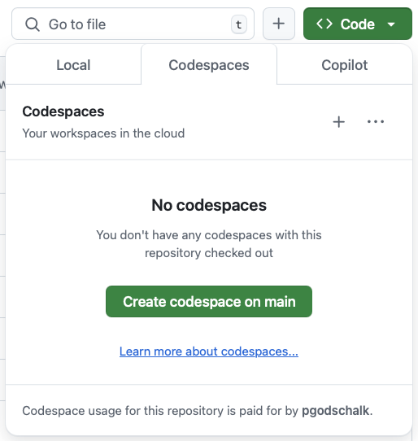

<!-- markdownlint-disable -->

<a id="readme-top"></a>

<!-- PROJECT SHIELDS -->

[![Contributors][contributors-shield]][contributors-url]
[![Forks][forks-shield]][forks-url]
[![Stargazers][stars-shield]][stars-url]
[![Issues][issues-shield]][issues-url]
[![MIT][license-shield]][license-url]
[![LinkedIn][linkedin-shield]][linkedin-url]

<!-- PROJECT LOGO -->
<br />
<div align="center">
  <h3 align="center">@pgodschalk/urlsparkle</h3>

  <p align="center">
    An URL-shortening API made for an engineering assessment
    <br />
    <a href="https://pgodschalk.github.io/urlsparkle/"><strong>Explore the docs »</strong></a>
    <br />
    <br />
    <a href="https://github.com/pgodschalk/urlsparkle/issues/new?labels=bug&template=bug-report---.md">Report Bug</a>
    ·
    <a href="https://github.com/pgodschalk/urlsparkle/issues/new?labels=enhancement&template=feature-request---.md">Request Feature</a>
</div>

<!-- TABLE OF CONTENTS -->
<details>
  <summary>Table of Contents</summary>
  <ol>
    <li>
      <a href="#about-the-project">About the project</a>
      <ul>
        <li><a href="#built-with">Built with</a></li>
      </ul>
    </li>
    <li>
      <a href="#getting-started">Getting started</a>
      <ul>
        <li><a href="#prerequisites">Prerequisites</a></li>
        <li><a href="#installation">Installation</a></li>
      </ul>
    </li>
    <li><a href="#usage">Usage</a></li>
    <li><a href="#roadmap">Roadmap</a></li>
    <li><a href="#contributing">Contributing</a></li>
    <li><a href="#license">License</a></li>
    <li><a href="#contact">Contact</a></li>
    <li><a href="#acknowledgments">Acknowledgments</a></li>
  </ol>
</details>

<!-- ABOUT THE PROJECT -->

## About the project

My implementation of writing an URL-shortening API with FastAPI.

<p align="right">(<a href="#readme-top">back to top</a>)</p>

### Built with

- [![Python][python]][python-url]

<p align="right">(<a href="#readme-top">back to top</a>)</p>

<!-- GETTING STARTED -->

## Getting started

To get a local copy up and running follow these simple example steps.

### Prerequisites

- [Python](https://python.org)
  ```sh
  asdf plugin add python
  asdf install python 3.13.2
  ```
- [uv](https://docs.astral.sh/uv/)
  ```sh
  asdf plugin add uv
  asdf install uv latest && asdf set -h uv latest
  ```
- [Postgres](https://www.postgresql.org)

### Installation

1. Clone the repo
   ```sh
   git clone https://github.com/pgodschalk/urlsparkle.git
   ```
2. Install dependencies
   ```sh
   cd backend
   uv sync
   ```
3. Change git remote url to avoid accidental pushes to base project
   ```sh
   git remote set-url origin pgodschalk/urlsparkle
   git remote -v # confirm the changes
   ```

<p align="right">(<a href="#readme-top">back to top</a>)</p>

<!-- USAGE EXAMPLES -->

## Usage

### Codespace

The easiest way is to use a GitHub Codespace. This will automatically set up
the environment and run migrations.



Running a development server:

```sh
cd backend/
source .venv/bin/activate
fastapi dev app/main.py
```

To run tests:

```sh
cd backend/
source .venv/bin/activate
pytest
```

### Docker

To run both PostgreSQL and the development server in a Docker container:

```sh
docker compose up -d postgresql
docker compose run urlsparkle alembic upgrade head
docker compose up -d
```

By default this will pull the `latest-dev` image built off the `main` branch.
Images are published for both x86 and ARM architectures.

This will expose the FastAPI server on `http://localhost:8000`, and PostgreSQL
on port `5432`. Both can be overridden by setting the `APP_PORT` and
`POSTGRES_PORT` variables respectively, e.g.:

```sh
APP_PORT=8081 POSTGRES_PORT=5433 docker compose up -d
```

Running tests:

```sh
docker compose exec urlsparkle pytest
```

### Native

A PostgreSQL server must already be present, and its connection details must be
configured in `.env`. See `.env.example`.

Ensure the virtualenv is active:

```sh
source backend/.venv/bin/activate
```

Running migrations:

```sh
cd backend/
alembic upgrade head
```

Running a development server:

```sh
cd backend/
fastapi dev app/main.py
```

Running tests:

```sh
cd backend/
python -m pytest
```

<!-- ROADMAP -->

## Roadmap

There are a few things that can be improved:

- [ ] Implement caching for the URL redirections. The easiest way is to handle
      this at the load balancer level. It does mean that the `/update` endpoint
      must emit an event to invalidate the cache.
- [ ] Use database triggers to handle updating the `last_redirect` field
      instead of handling this at the application level (out of scope for now).
- [ ] Add a frontend :)
- [ ] Fix the `pytest` warnings about the `session.query()` being deprecated.
      Blocked by [sqlmodel#909](https://github.com/fastapi/sqlmodel/issues/909)

<p align="right">(<a href="#readme-top">back to top</a>)</p>

<!-- CONTRIBUTING -->

## Contributing

Contributions are what make the open source community such an amazing place to learn, inspire, and create. Any contributions you make are **greatly appreciated**.

If you have a suggestion that would make this better, please fork the repo and create a pull request. You can also simply open an issue with the tag "enhancement".
Don't forget to give the project a star! Thanks again!

1. Fork the Project
2. Create your Feature Branch (`git checkout -b feature/AmazingFeature`)
3. Commit your Changes (`git commit -m 'Add some AmazingFeature'`)
4. Push to the Branch (`git push origin feature/AmazingFeature`)
5. Open a Pull Request

<p align="right">(<a href="#readme-top">back to top</a>)</p>

### Top contributors:

<a href="https://github.com/pgodschalk/urlsparkle/graphs/contributors">
  
</a>

<!-- LICENSE -->

## License

Distributed under the MIT License. See `LICENSE.txt` for more information.

<p align="right">(<a href="#readme-top">back to top</a>)</p>

<!-- CONTACT -->

## Contact

Patrick Godschalk - [@kernelpanics.nl](https://bsky.app/profile/kernelpanics.nl) - patrick@kernelpanics.nl

Project Link: [https://github.com/pgodschalk/urlsparkle](https://github.com/pgodschalk/urlsparkle)

<p align="right">(<a href="#readme-top">back to top</a>)</p>

<!-- ACKNOWLEDGMENTS -->

## Acknowledgments

- [FastAPI](https://fastapi.tiangolo.com)

<p align="right">(<a href="#readme-top">back to top</a>)</p>

<!-- MARKDOWN LINKS & IMAGES -->
<!-- https://www.markdownguide.org/basic-syntax/#reference-style-links -->

[contributors-shield]: https://img.shields.io/github/contributors/pgodschalk/urlsparkle.svg?style=for-the-badge
[contributors-url]: https://github.com/pgodschalk/urlsparkle/graphs/contributors
[forks-shield]: https://img.shields.io/github/forks/pgodschalk/urlsparkle.svg?style=for-the-badge
[forks-url]: https://github.com/pgodschalk/urlsparkle/network/members
[stars-shield]: https://img.shields.io/github/stars/pgodschalk/urlsparkle.svg?style=for-the-badge
[stars-url]: https://github.com/pgodschalk/urlsparkle/stargazers
[issues-shield]: https://img.shields.io/github/issues/pgodschalk/urlsparkle.svg?style=for-the-badge
[issues-url]: https://github.com/pgodschalk/urlsparkle/issues
[license-shield]: https://img.shields.io/github/license/pgodschalk/urlsparkle?style=for-the-badge
[license-url]: https://github.com/pgodschalk/urlsparkle/blob/main/LICENSE.txt
[linkedin-shield]: https://img.shields.io/badge/-LinkedIn-black.svg?style=for-the-badge&logo=linkedin&colorB=555
[linkedin-url]: https://linkedin.com/in/patrick-godschalk
[python]: https://img.shields.io/badge/python-3776AB?style=for-the-badge&logo=python&logoColor=white
[python-url]: https://www.python.org
